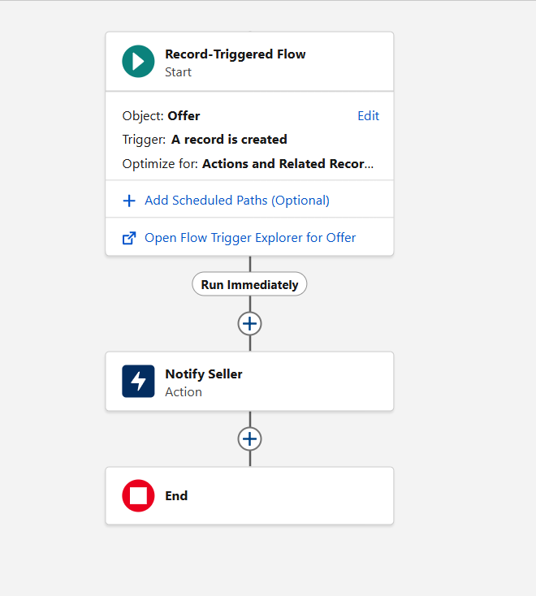
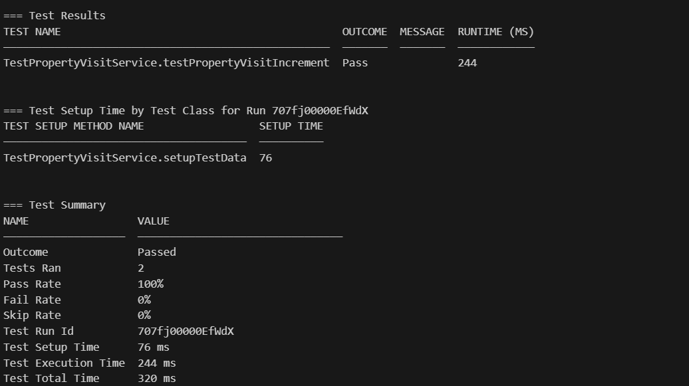

# 🏡 Real Estate 360 – Salesforce Application

Real Estate 360 is a Salesforce-based application designed to manage property listings, offers, visits, and commissions using a combination of **Salesforce Admin configuration** and **Developer tools (Apex, Triggers, LWC)**.  
This project demonstrates real-world Salesforce development practices, including data modeling, automation, custom UI, reporting, and testing.

---

## 🚀 Project Objective

To build a real-world **Salesforce Sales Cloud application** that simulates how a real estate company manages:

- Properties and sellers
- Buyer offers
- Property visits
- Agent commissions
- Automation and analytics

This project is intended as a **portfolio project for a Salesforce Developer**.

---

## ☁️ Salesforce Cloud Used

- **Sales Cloud**

---

## 🧱 Data Model

### 🔹 Property__c
Represents a real estate property.

**Key Fields:**
- Name
- Address__c
- Area_sq_ft__c
- Listed_Date__c
- Price__c
- Seller__c (Lookup → Account)
- Status__c (Available, Under Offer, Sold)
- Total_Visits__c
- Property_Type__c (Villa, Apartment, Plot)

---

### 🔹 Offer__c
Represents an offer made by a buyer on a property.

**Relationships:**
- Master-Detail → Property__c
- Lookup → Account (Buyer__c)

**Key Fields:**
- Offer_Amount__c
- Offer_Status__c (New, Accepted, Rejected)
- Buyer__c
- Offer_Date__c

---

### 🔹 Property_Visit__c
Tracks visits made to a property.

**Relationship:**
- Master-Detail → Property__c

---

### 🔹 Commission__c
Tracks commission earned by an agent after deal closure.

**Relationship:**
- Master-Detail → Offer__c

**Key Fields:**
- Commission_Percentage__c
- Commission_Amount__c (Formula)
- Agent__c (Lookup → User)
- Payment_Status__c

---

## 🛠️ Admin Configuration

- Custom App: **Real Estate 360**
- Custom Objects and Fields
- Permission Set for access control
- Page Layouts & Record Types
- Validation Rules
- Reports & Dashboards

---

## ⚙️ Automation & Development

### 🔹 Apex & Triggers
Bulk-safe Apex architecture using:
- Trigger Handler Pattern
- Selector Classes
- Service Classes

**Implemented Logic:**
- Validate Offer Amount ≥ Property Price
- Auto-update Property Status to *Under Offer*
- Auto-increment Total Visits when a visit is created

---

### 🔹 Lightning Web Component (LWC)

**Component:** `propertyList`

**Features:**
- Displays property records in a custom UI
- Filters by:
  - Property Status
  - Property Type
  - Price Range
- Shows seller name instead of ID
- Real-time data loading via Apex Controller

This demonstrates **custom UI development** beyond standard Lightning App Builder capabilities.

---

### 🔹 Salesforce Flow

**Flow:** Notify Seller on New Offer

- Type: Record-Triggered Flow
- Triggered when a new Offer__c is created
- Automatically sends an email notification to the seller (Account)
- Demonstrates declarative automation alongside Apex

---

## 📊 Reports & Dashboards

**Reports Created:**
- Properties by Status
- Properties by Type
- Total Visits per Property

**Dashboard:**
- Visual representation of property distribution and engagement

---

## 🧪 Testing

- Apex Test Classes created for all Apex logic
- All tests pass successfully
- Bulk-safe test data created using `@testSetup`
- Code coverage meets Salesforce deployment standards

> Note: Test data created in test classes does not persist in the org, as Salesforce runs tests in an isolated context.

---

## 🔑 Key Skills Demonstrated

- Salesforce Data Modeling
- Apex Programming & Triggers
- Bulk-safe Apex Architecture
- Lightning Web Components (LWC)
- Salesforce Flow Automation
- Reports & Dashboards
- Testing & Debugging
- Git & GitHub version control

---

## 📌 Why Buyer__c Field Exists

The **Buyer__c (Lookup → Account)** field is included to:
- Represent real-world buyer entities
- Support reporting and future enhancements
- Enable scalability (e.g., buyer notifications, analytics)

While not used in automation currently, it reflects **realistic data modeling**.

## Screenshots

### Property List (LWC)
   NoifyEmailFlow

### Notification Flow

### Test Property Visit Service(Test Class)

### Test Offer Service(Test Class)

---
