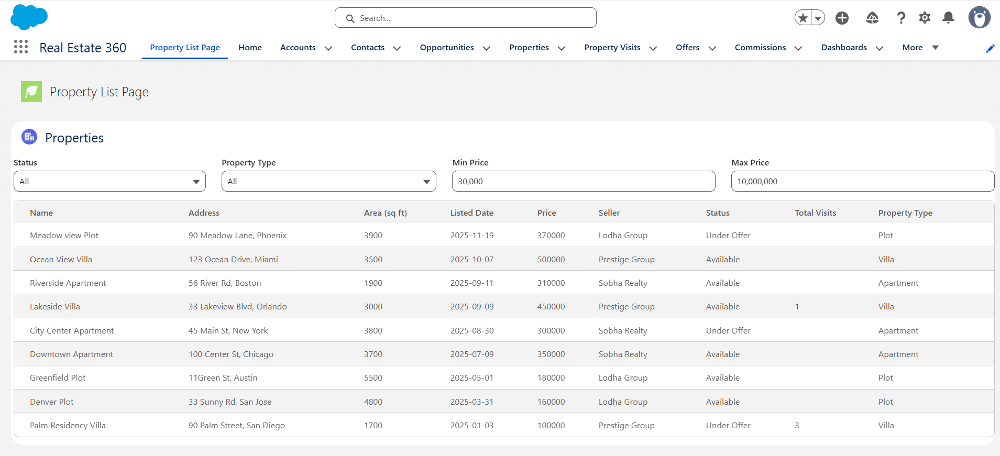
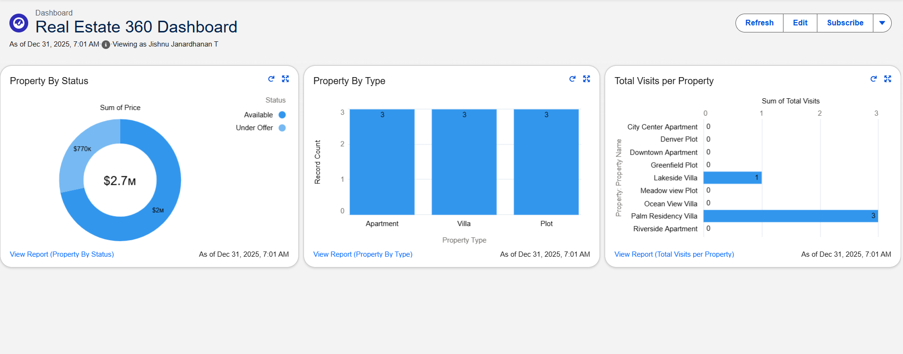

# Real Estate 360 – Salesforce Application

Real Estate 360 is a Salesforce-based application designed to manage property listings, offers, visits, and commissions using a combination of **Salesforce Admin configuration** and **Developer tools (Apex, Triggers, LWC)**.

This project demonstrates real-world Salesforce development practices including **data modeling, automation, custom UI development, reporting, and testing**.  
It is built as a **portfolio project for a Salesforce Developer**.

---

## Project Objective

To build a real-world **Salesforce Sales Cloud application** that simulates how a real estate company manages:

- Properties and sellers  
- Buyer offers  
- Property visits  
- Agent commissions  
- Automation and analytics  

---

## Salesforce Cloud Used

- **Sales Cloud**

---

## Data Model

### Property__c
Represents a real estate property.

**Key Fields:**
- Name  
- Address__c  
- Area_sq_ft__c  
- Listed_Date__c  
- Price__c  
- Seller__c (Lookup → Account)  
- Status__c (Available, Under Offer, Sold)  
- Total_Visits__c  
- Property_Type__c (Villa, Apartment, Plot)

---

### Offer__c
Represents an offer made by a buyer on a property.

**Relationships:**
- Master-Detail → Property__c  
- Lookup → Account (Buyer__c)

**Key Fields:**
- Offer_Amount__c  
- Offer_Status__c (New, Accepted, Rejected)  
- Buyer__c  
- Offer_Date__c  

---

### Property_Visit__c
Tracks visits made to a property.

**Relationship:**
- Master-Detail → Property__c  

---

### Commission__c
Tracks commission earned by an agent after deal closure.

**Relationship:**
- Master-Detail → Offer__c  

**Key Fields:**
- Commission_Percentage__c  
- Commission_Amount__c (Formula)  
- Agent__c (Lookup → User)  
- Payment_Status__c  

---

## Admin Configuration

- Custom App: **Real Estate 360**
- Custom Objects and Fields
- Permission Set for access control
- Page Layouts & Record Types
- Validation Rules
- Reports & Dashboards

---

## Apex & Triggers

Bulk-safe Apex architecture implemented using:
- Trigger Handler Pattern
- Selector Classes
- Service Classes

**Automations Implemented:**
- Validate that Offer Amount ≥ Property Price  
- Auto-update Property Status to *Under Offer*  
- Auto-increment Total Visits when a Property Visit is created  

---

## Lightning Web Component (LWC)

**Component:** `propertyList`

**Features:**
- Displays property records in a custom UI
- Filters by:
  - Property Status
  - Property Type
  - Price Range
- Displays Seller Name instead of Seller ID
- Real-time data loading using Apex Controller

This demonstrates **custom UI development beyond standard Lightning App Builder**.

---

## Salesforce Flow

**Flow:** Notify Seller on New Offer

- Type: Record-Triggered Flow
- Triggered when a new Offer__c record is created
- Automatically sends an email notification to the seller (Account)
- Demonstrates declarative automation working alongside Apex logic

---

## Reports & Dashboards

**Reports Created:**
- Properties by Status
- Properties by Type
- Total Visits per Property

**Dashboard:**
- Visual representation of property distribution and engagement metrics

---

## Testing

- Apex Test Classes created for all Apex logic
- All tests pass successfully
- Bulk-safe test data created using `@testSetup`
- Code coverage meets Salesforce deployment standards

### Test Classes

---

## Key Skills Demonstrated

- Salesforce Data Modeling
- Apex Programming & Triggers
- Bulk-safe Apex Architecture
- Lightning Web Components (LWC)
- Salesforce Flow Automation
- Reports & Dashboards
- Validation Rules & Security
- Salesforce DX (SFDX)
- Git & GitHub Version Control

---

## Tools & Technologies

- Salesforce Developer Edition
- Salesforce DX (SFDX)
- Visual Studio Code
- Git & GitHub
- Lightning Experience

---

